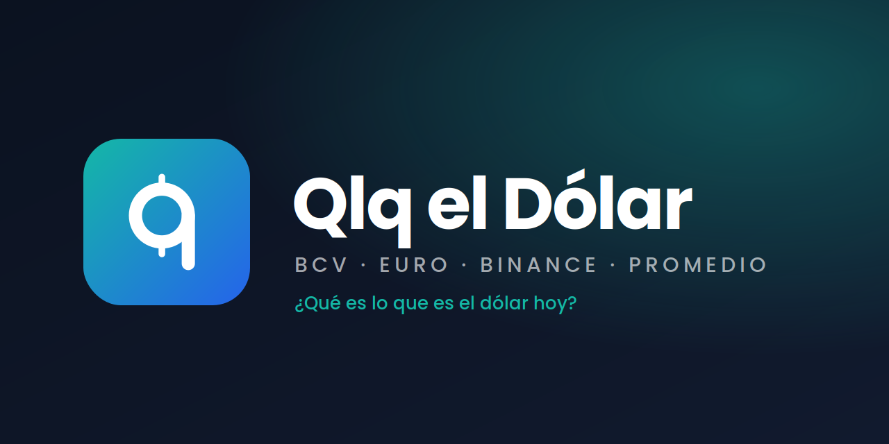

<p align="center">
  
</p>

# Qlq el Dólar

> *"¿Qué es lo que es el dólar?"* — la tasa del día en Venezuela, sin vueltas.

App Android/iOS (Flutter) para consultar la tasa Bs/USD del **BCV**, **Euro**, **Binance P2P** y un **Promedio** BCV–Binance, con calculadora bidireccional Bs ⇄ USD/EUR. Modo claro y oscuro.

Los datos vienen de un backend propio en NestJS que hace scraping del BCV y consulta la API pública de Binance P2P (repo aparte).

## 📥 Descargar

La última versión para Android está en **[Releases](../../releases/latest)** → archivo `QlqElDolar-vX.Y.Z.apk`.

Instalación: descarga el APK en el teléfono, ábrelo y acepta "instalar de fuentes desconocidas" si Android lo pide.

## 🧱 Estructura

```
lib/
  main.dart / app.dart          → arranque, tema, ProviderScope
  core/
    config/                     → AppConfig (URL del backend), SharedPreferences provider
    theme/                      → colores y ThemeData claro/oscuro
    utils/formatters.dart       → formato venezolano (1.234,56), input estilo banco
    widgets/                    → BrandMark (logo vectorial), GlassCard, AnimatedNumber, ShimmerBox
  features/
    rates/                      → dominio (Rate, RateSource), API/repositorio con caché, providers
    converter/                  → lógica de la calculadora + tarjeta UI
    home/                       → pantalla principal y widgets (selector, hero card, resumen)
    settings/                   → tema claro/oscuro persistido
assets/branding/                → kit de marca (íconos, wordmark, banner) en SVG y PNG
.github/workflows/release.yml   → construye el APK y lo sube a Releases al crear un tag
```

Estado con **Riverpod**. El backend por defecto es `https://qlqeldolar-backend.onrender.com/api` (Render, plan free: la primera consulta tras un rato inactivo tarda 30-60 s). Se puede cambiar con `--dart-define=API_BASE_URL=...`.

## 🛠️ Desarrollo

```bash
flutter pub get
# Emulador Android (el backend corre en tu PC en :3000)
flutter run --dart-define=API_BASE_URL=http://10.0.2.2:3000/api
# Teléfono físico en la misma WiFi
flutter run --dart-define=API_BASE_URL=http://192.168.1.XX:3000/api
```

## 🚀 Publicar una versión

1. Sube `version:` en `pubspec.yaml` (ej. `1.1.0+2`).
2. Commit y tag:
   ```bash
   git commit -am "v1.1.0"
   git tag v1.1.0
   git push && git push --tags
   ```
3. GitHub Actions compila el APK y lo publica en Releases.

> Opcional: si el backend cambia de URL, define la variable de repositorio `API_BASE_URL` en *Settings → Secrets and variables → Actions → Variables*; si no existe, se usa la de Render.

## 🎨 Marca

Ver [`assets/branding/README.md`](assets/branding/README.md).
